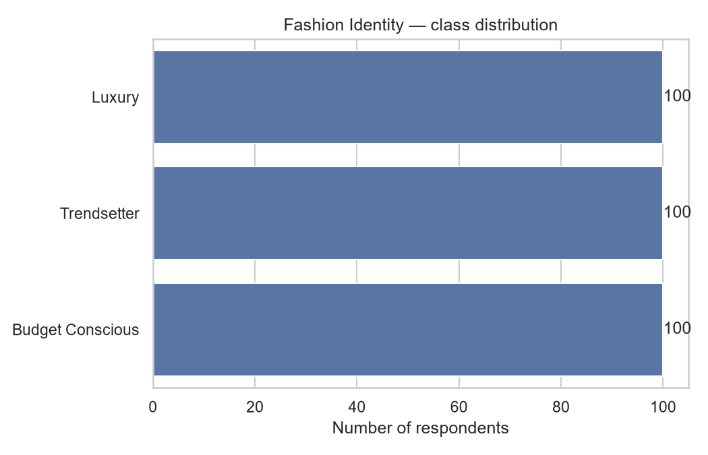
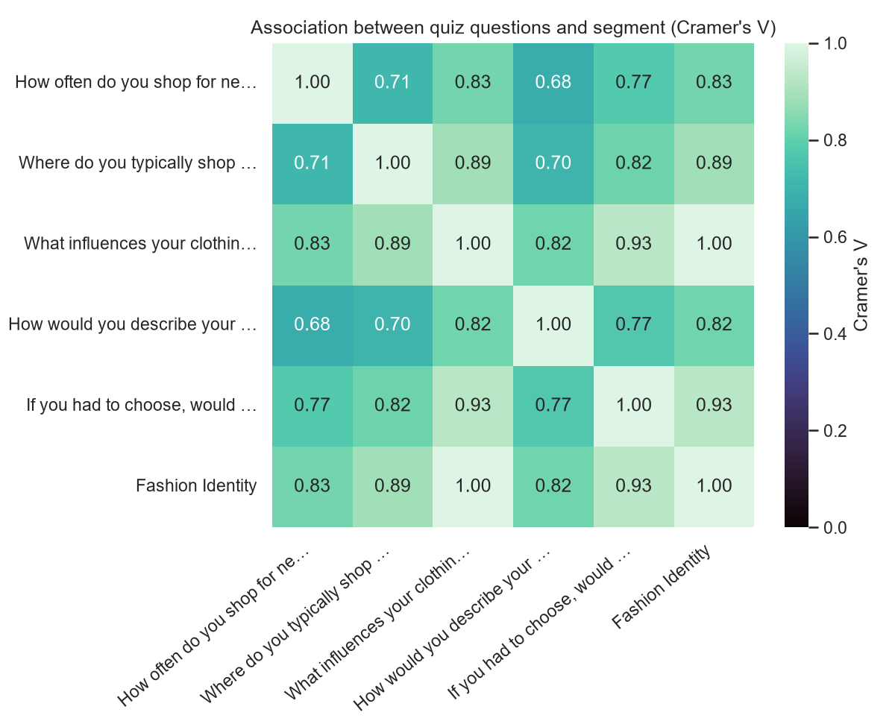
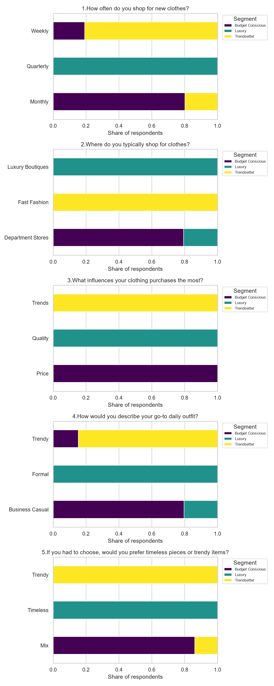

# Exploratory Data Analysis — Fashion Identity Classifier

**Rows analyzed:** 300

## Class distribution

- **Luxury**: 100
- **Trendsetter**: 100
- **Budget Conscious**: 100

Class balance ratio (smallest/largest class): **1.0** (1.0 = perfectly balanced)

## Feature associations with segment (chi-square test)

| Feature | chi² | p-value | Significant (p<0.05) |
|---|---|---|---|
| 3.What influences your clothing purchases the most? | 600.0 | 1.55e-128 | Yes |
| 5.If you had to choose, would you prefer timeless pieces or trendy items? | 517.241 | 1.25e-110 | Yes |
| 2.Where do you typically shop for clothes? | 476.19 | 9.443e-102 | Yes |
| 1.How often do you shop for new clothes? | 411.641 | 8.489e-88 | Yes |
| 4.How would you describe your go-to daily outfit? | 408.164 | 4.789e-87 | Yes |

**Most predictive question:** 3.What influences your clothing purchases the most?

**Least predictive question:** 4.How would you describe your go-to daily outfit?

## Feature breakdown by segment

## Notes

- Cramer's V measures association strength for categorical variables (0 = none, 1 = perfect), used here in place of a Pearson correlation matrix, which doesn't apply to non-numeric data.
- The chi-square test flags whether each quiz question's answers are statistically associated with the assigned segment, independent of the classifier itself — useful for spotting low-value survey questions that could be dropped or reworded.
- This dataset is currently synthetic (rule-generated with light noise); expect these statistics to look artificially clean compared to real survey responses. Swap in real data via data/fashion_data.csv and re-run this script.